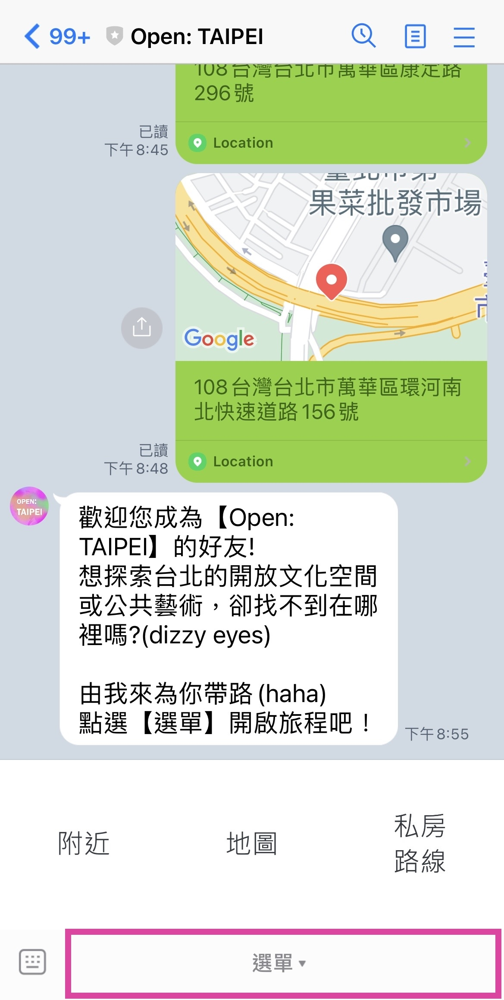

# linebot_artgo

## Line ID

@642ikktz

掃 QR code 或是點擊「加朋友」，加入「Open: TAIPEI」探索台北！

## 使⽤說明

## 公開資料來源

經緯度查詢附近文化設施資料
https://cloud.culture.tw/frontsite/opendata/emapOpenDataJsonAction.do?method=exportEmapJsonNearBy&lat=25.051345&lon=121.549569&range=10

## 未來版本升級規劃

新增私房推薦路線(北捷中山站…等等)

連結打開台北官網

精選地點(打開台北官網)

增加搜尋關鍵字功能

增加文字回覆、快速回覆

串接其他API(博物館、藝術村、創意園區、地方文化館、文資局紀念建築或史蹟)

